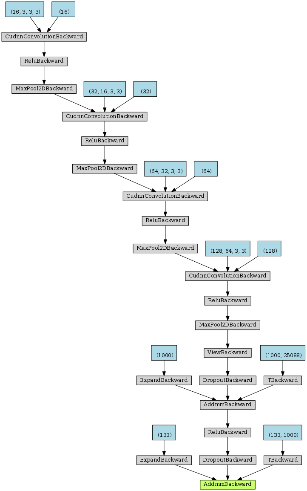
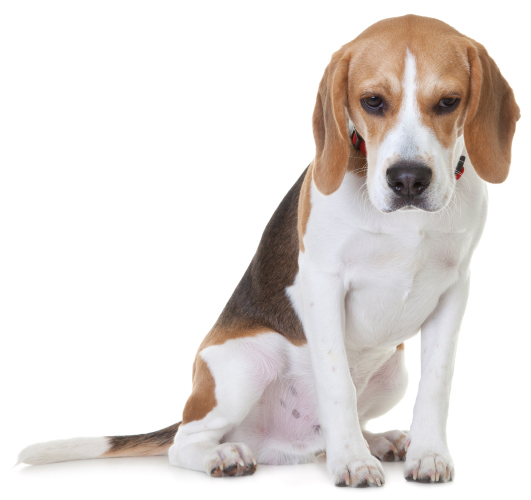
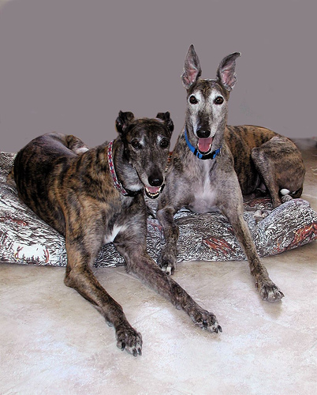
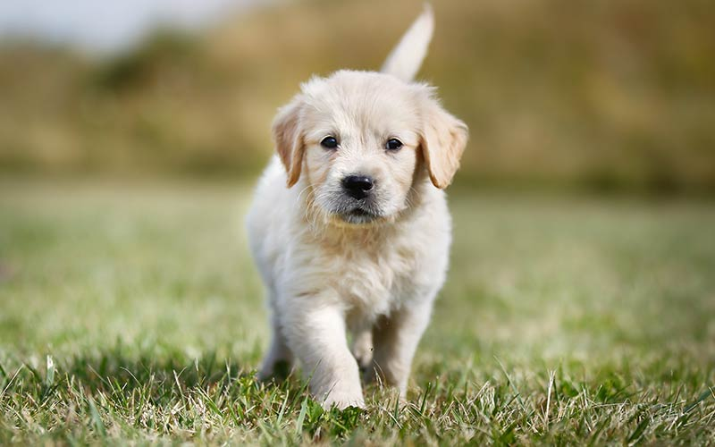

# dog-breed-prediction
CNN that classifies dog breeds 

In order to evaluate this code, make sure that you've downloaded the required dog dataset:
* Download the [dog dataset](https://s3-us-west-1.amazonaws.com/udacity-aind/dog-project/dogImages.zip).  Unzip the folder and place it in this project's home directory, at the location `/data/dog_images`. 

## Create a CNN to Classify Dog Breeds (from Scratch)

In this section, I'm creating a CNN that classifies dog breeds from scratch:

 

Test Accuracy of the model created from scratch after 55 epochs: 12% (102/836)

## Create a CNN to Classify Dog Breeds using Transfer Learning

Using transfer learning, I'm creating a CNN that classifies dog breeds using the pretrained ResNet50 architecture. 
ResNet50 is a deep residual network and a very good architecture with 50 layers perfectly suitable for image classification problems. The only adjustment I make to this pre-trained model is changing the number of output features for the last (fc) Linear layer which previously was 1000 (for detecting 1000 classes) to 133 which is the number of classes we are interested in detecting.

Test Accuracy of the model created using transfer learning after 30 epochs: 77% (649/836)

## Predicting Dog Breed with the Transfer Learning Model
Sample results:
_____________________________________________________________________________________________
 

Output class: **Beagle** 
_____________________________________________________________________________________________

 

Output class: **Greyhound** 
_____________________________________________________________________________________________

 

Output class: **Golden retriever**  
_____________________________________________________________________________________________

 

Output class: **Pomeranian** 
_____________________________________________________________________________________________

 

Output class: **Chow chow** 
